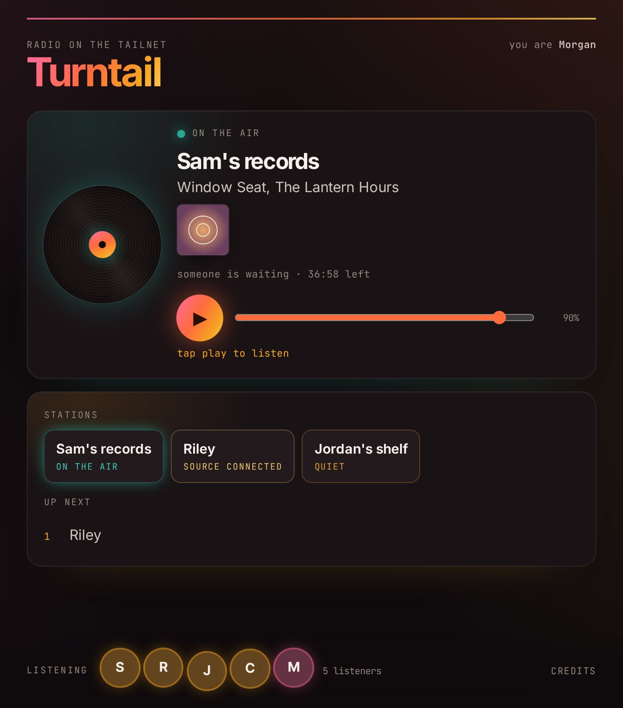
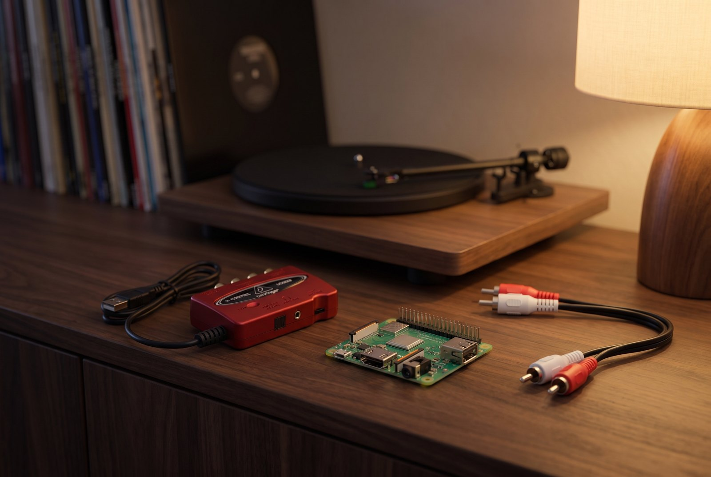

# Turntail

A Tailscale-based radio station for a group of friends to listen together.

We wanted a way for folks to take turns streaming records or other analog media (or really anything you can wire into the little box) for each other in a little network. So naturally it's built around Tailscale. It makes it easy to connect to and from anywhere, know who is who, and of course carry the tunes.

One of us runs the hub, a couple of us have a Raspberry Pi next to the turntable, and everyone else listens.

  

## What it does

- **One page for everyone.** Open it on a phone or a computer and press play. It shows who is on the air and what record is on the platter, who else is listening (names and pictures come from Tailscale, so there is no login screen), and who is waiting for a turn.
- **Stations take turns.** One station is live at a time. When someone else asks for a turn, the live station keeps what is left of its hour (at least ten minutes), gets a warning at five minutes, and has two minutes of grace to finish the track. The hub owner can change those numbers.
- **A station is a small Linux machine with a USB audio interface.** We suggest a [Raspberry Pi 3 Model A+](https://www.raspberrypi.com/products/raspberry-pi-3-model-a-plus/) and a [Behringer UCA222](https://www.sweetwater.com/store/detail/UCA222--behringer-u-control-uca222-usb-audio-interface) because they're inexpensive and tiny, so your computer doesn't have to sit next to the record player. Anything that runs Debian or Raspberry Pi OS and Tailscale should work. It sends one MP3 stream to the hub and reconnects by itself after a reboot, a dropped Wi-Fi link or a hub restart.
- **The hub is one simple server that one person runs.** We use a small cloud server, and another Raspberry Pi or a VM at home running Debian 13 should work too. Turntail opens no ports on it, because everything reaches it through Tailscale. Who can listen, who can broadcast and who can run the page all lives in one Tailscale policy file, and each station also gets its own password on the hub.
- **Something between records.** When nobody is on, the hub can play a loop of MP3s you give it, all leveled to the same loudness, or a spoken clock for checking the delay.

  

## Which guide is yours

| You want to | You need | Guide |
|---|---|---|
| Listen | Tailscale on a phone or computer, plus a share link and the page address from whoever runs the hub | [Listening](docs/listening.md) |
| Play your records | A Raspberry Pi or other Linux machine, a USB audio interface, a turntable or anything else with a line output, and three values from whoever runs the hub | [Broadcasting](docs/broadcasting.md) |
| Run a hub for your friends | A Tailscale account and a Debian 13 machine | [Hosting](docs/hosting.md) |

## Caveats

- It is built for one hub per group of friends. We run one for a few people, and the queue rules are what felt fair to us. It has not been load tested beyond that.
- Everyone hears the record a few seconds behind the needle. Between the internet, relays and buffering it isn't exactly real time, and that's ok. We're streaming vinyl anyway.
- Stations are tested on a Raspberry Pi 3 Model A+ and a Raspberry Pi 5. We'll add others as we test them.
- The hub has only run on a cloud server so far.
- Sound is MP3 at 256 kbps with a limiter as a ceiling and no other processing.
- The record lookup on the page uses Discogs, with MusicBrainz as a fallback, and both are rate limited.

If you set one up for your own group, we'd love to hear how it goes.

## License

MIT. See [LICENSE](LICENSE).
