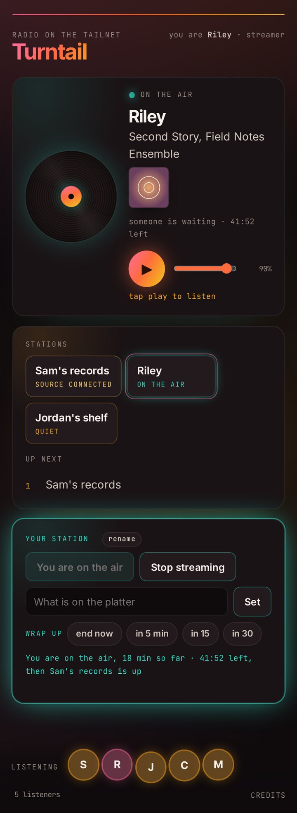

# Broadcasting

This guide sets up a station: a Raspberry Pi next to your turntable that sends your records to the hub, so your friends hear them on the page. It takes about an hour, most of it waiting for the Pi. You write a memory card on your computer, and everything after that happens in your web browser. Nobody else needs to touch your Pi.

<p align="center">
  
</p>

## What you need

| Part | Notes |
|---|---|
| A Raspberry Pi 3 Model A+, Pi 4 or Pi 5 | The 3A+ and Pi 5 are tested, and the Pi 4 should work the same. Another Debian machine, like an old laptop, should work too: skip steps 2 to 4, keep its own name in place of `<station name>-station`, and know that setup turns off MagicDNS on it. The 3A+ is the cheapest that does the job. Raspberry Pi's [product page](https://www.raspberrypi.com/products/raspberry-pi-3-model-a-plus/) lists approved resellers for your country, or in the US try [Adafruit](https://www.adafruit.com/product/4027). |
| The right power supply for it | Check the plug before you buy: the Pi 4 and Pi 5 take USB-C, the 3A+ takes micro-USB (5 V 2.5 A, [Adafruit](https://www.adafruit.com/product/1995)). The official Raspberry Pi supply for your board is the safe choice. |
| A case | Optional, and nice to have since the Pi sits next to the turntable. The official case for your board is an easy pick, for example the [3A+ case](https://www.adafruit.com/product/4096). |
| A microSD card | 8 GB or larger. Everything on it gets erased. |
| A USB audio interface with a stereo line input | We use the Behringer UCA222 ([Amazon](https://www.amazon.com/dp/B0023BYDHK), [Sweetwater](https://www.sweetwater.com/store/detail/UCA222--behringer-u-control-uca222-usb-audio-interface), [B&H](https://www.bhphotovideo.com/c/product/1821212-REG/behringer_uca222_16_bit_48khz_2_channel_usb_audio.html)). Any USB audio interface that works without a driver should work, and setup finds it by itself. |
| A stereo RCA cable | Red and white plugs at both ends, from the turntable to the interface. |
| A turntable with a LINE output | Many have a LINE/PHONO switch on the back. If yours only has a PHONO output, either put a phono preamp between the turntable and the interface, or use a [Behringer UFO202](https://www.sweetwater.com/store/detail/UFO202--behringer-u-phono-ufo202-usb-audio-interface) instead of the UCA222. It's the same kind of interface with a phono preamp built in. We haven't tested it yet. |
| A computer | Mac, Windows or Linux, to write the card and to type a few commands into the Pi from a browser. |
| Your Wi-Fi name and password | The Pi joins your Wi-Fi. |
| A Tailscale account | Free for personal use. The [listening guide](listening.md) covers making one. |
| A Raspberry Pi ID | Free, from [id.raspberrypi.com](https://id.raspberrypi.com/). It lets you open a terminal on your Pi from your browser. |

This guide assumes you are already a listener: you followed the [listening guide](listening.md), and the page plays on your phone. That matters for the Pi, because it can only reach the hub through a Tailscale account that has accepted the hub's share.

From whoever runs the hub you then get **one line with three values**: the hub name, your station name and your station password. It looks like this:

```
HUB=turntail.example-tailnet.ts.net MOUNT=alice MOUNT_PW=Xq3...
```

The password is yours alone. Keep that line somewhere private.

## 1. Send the hub owner your login

1. Open the [Machines page](https://login.tailscale.com/admin/machines) of your Tailscale admin console, signed in with the account you listen with. The hub is listed there, marked as shared with you. That is the account the Pi will use too.
2. Find your login on the [Users page](https://login.tailscale.com/admin/users), under your name. It is usually an email address, or something like `alice@github` if you signed in with GitHub.
3. Send that login to the hub owner. They add it to the hub so your station is allowed to broadcast, and they send you back the line with your three values.

You can carry on with steps 2 to 5 while you wait for the line.

## 2. Write the card

1. On your computer, install and open [Raspberry Pi Imager](https://www.raspberrypi.com/software/), version 2.0 or later.
2. Choose your device: Raspberry Pi 4, Raspberry Pi 5, or Raspberry Pi 3 for the 3A+.
3. Choose the operating system: **Raspberry Pi OS (other)**, then **Raspberry Pi OS Lite (64-bit)**.
4. Choose your microSD card.
5. Imager then walks you through the customisation settings one page at a time. Fill them in like this:

    | Setting | What to put |
    |---|---|
    | Hostname | `station` |
    | Username and password | Your own choice. Write them down. |
    | Wi-Fi | Your Wi-Fi name and password, and your country. |
    | Time zone and keyboard | Yours. |
    | Raspberry Pi Connect | Turn it on, press **Open Raspberry Pi Connect**, and sign in with your Raspberry Pi ID. Imager picks up the sign-in by itself. |
    | SSH | Your choice. If this is your first Pi, leave it off, because Connect is the easier way in. Turn it on if you also want to log in from a terminal on your computer. |

6. Write the card and wait until Imager says it is finished.

## 3. Plug everything in

1. Put the card in the Pi.
2. Plug the USB audio interface into a USB port on the Pi.
3. Connect the RCA cable from the turntable's output to the interface's **INPUT** jacks, red to red and white to white. The UCA222 also has OUTPUT jacks, and those are the wrong ones. If the turntable has a LINE/PHONO switch, set it to **LINE**.
4. Plug in the power last.

The first boot takes a few minutes while the Pi sets itself up, and a 3A+ is slower than a Pi 4 or 5. Give it five minutes.

## 4. Open a terminal on the Pi in your browser

1. On your computer, go to [connect.raspberrypi.com](https://connect.raspberrypi.com/) and sign in with your Raspberry Pi ID.
2. Your Pi is listed as `station`. If it isn't there yet, give it another few minutes, then reload.
3. Choose **Connect via**, then **Remote shell**.

A terminal opens in a new browser tab, already logged in to the Pi. Everything from here on is typed or pasted into that tab.

If you would rather not use the browser, a keyboard and monitor plugged into the Pi work too. Log in with the username and password from step 2, and type the same commands.

## 5. Get Turntail onto the Pi

```
sudo apt-get update
sudo apt-get install -y git
git clone https://github.com/chriscantey/turntail.git
```

## 6. Run setup with your three values

When the line with your three values has arrived, type `sudo `, paste the line into the browser terminal, then type ` bash ~/turntail/station/setup.sh` and press Enter. The whole thing looks like this:

```
sudo HUB=<hub name> MOUNT=<station name> MOUNT_PW=<station password> bash ~/turntail/station/setup.sh
```

Setup prints a heading for each stage, starting with `== packages`. Installing the packages takes a while, longer on a 3A+. Keep the browser tab open the whole time, because closing or reloading it stops setup. Then it installs Tailscale.

## 7. Log the Pi in to Tailscale as yourself

At `== tailscale`, setup prints `Log this device in to YOUR tailnet (the one you accepted the share with):` and then a link that starts with `https://login.tailscale.com/`. It waits there until you use the link.

1. Click the link, or copy it into a new browser tab.
2. Sign in with the **same Tailscale account you used in step 1**, and connect the device.

The Pi joins your Tailscale network as an ordinary device, logged in as you, and it shows up in your Machines list as `<station name>-station`. It uses no auth key and no tags, because a tagged device cannot use a shared machine. If you ever need to log the Pi in again, run `sudo tailscale logout` and then the step 6 command.

Setup carries on by itself. These are the lines that matter:

- `hub port 8000 reachable` means the Pi can reach the hub, and the hub has let your login in to send audio.
- `using hw:CARD=...` names the audio interface it found, for the UCA222 something like `hw:CARD=CODEC,DEV=0 (CODEC [USB Audio CODEC] ...)`.
- `== done.` is the last line.

If it stops with `cannot reach <hub>:8000`, either the hub owner has not added your login yet, or the Pi is logged in to a different Tailscale account than the one that accepted the share. For the first, ask the hub owner. For the second, run `sudo tailscale logout`, then the step 6 command again and sign in with the right account. Setup is safe to run as many times as you like.

If it prints `WARNING: no USB audio capture device found`, check that the interface is plugged in, then run the step 6 command again.

## 8. Check the sound

Put a record on, then run:

```
sudo turntail-station test 10
```

It records ten seconds from the interface and prints two numbers. Look at `max_volume`:

- **Above -20 dB** is good.
- **Between -30 and -20 dB** is a little quiet. Turn it up with `sudo turntail-station gain 6`. The test always measures the input before gain, so its numbers stay the same. Listen on the page to hear the difference.
- **Around -50 dB or lower** means no signal. Check the LINE/PHONO switch, that the cable goes into INPUT, and that the record is actually playing.

The test pauses the stream for those ten seconds, so run it before you go live, not during.

Then run:

```
sudo turntail-station status
```

The `service` line should say `active` and the `hub` line should say `reachable`.

## 9. Go live

On your phone or laptop, with Tailscale on, open the page address. Under **Stations** your station shows "source connected", and below that there is a **Your station** card.

<p align="center">
  
</p>

1. Press **Go live**. If someone else is on the air, the button says **Ask for the next slot** instead, and you go on when their turn ends.
2. Drop the needle.
3. Press play at the top of the page to hear yourself a few seconds late.

When you are done, press **Stop streaming**. If the page says your station has no source connected, run `sudo turntail-station status` on the Pi and look at the `hub` line.

While you are on, the card shows how long is left, has buttons to wrap up early, and has a box for what is on the platter. Type the record's name and pick it from the list, and everyone sees the title, and the cover if the hub has a Discogs token.

## 10. Turn off key expiry for the station

Tailscale logs a device out after 180 days unless you turn that off, and the station would just stop with no visible reason. In your [Machines page](https://login.tailscale.com/admin/machines), open the menu on the `<station name>-station` row and choose **Disable key expiry**.

## 11. The browser terminal from here on

Leave it on. It is how you reach the Pi for the commands below, and only your Raspberry Pi ID can open it. If you would rather turn it off, run `rpi-connect shell off`. After that you need a keyboard and monitor on the Pi to type commands, including `rpi-connect shell on` to bring the browser terminal back.

## Day to day

The Pi starts streaming by itself whenever it has power. It sends to the hub all the time it is on, about 115 MB an hour, whether or not you are on the air. If that matters on your connection, switch it off between sessions.

```
sudo turntail-station status              what it is doing, can it reach the hub
sudo turntail-station test 10             record ten seconds, print how loud it is
sudo turntail-station gain 3              a little louder (or -3 for quieter, 0 to reset)
sudo turntail-station source turntable    send the turntable (the default)
sudo turntail-station source demo         a spoken clock instead, to check the delay
sudo turntail-station source off          stop sending until you switch it back
sudo turntail-station devices             list the audio devices the Pi can record from
sudo turntail-station logs                follow what the station is doing (Ctrl-C to stop)
```

To get back into the Pi later, open its remote shell at [connect.raspberrypi.com](https://connect.raspberrypi.com/) as in step 4.

## If something is off

- **The browser tab closed or reloaded during setup.** Run `sudo dpkg --configure -a`, then the step 6 command again. Setup picks up where it left off.
- **No sound on the page, but you are live.** Run `sudo turntail-station test 10` with the record playing and read the numbers as in step 8.
- **The interface is missing.** `sudo turntail-station devices` lists what the Pi can record from. If your interface is not there, unplug it and plug it back in, then run the step 6 command again.
- **`status` says NOT reachable.** Check that Tailscale is still logged in with `tailscale status`, that the hub still appears in your Machines list, and ask the hub owner whether your login is still on the hub.
- **Quiet and thin, or a hum.** That is usually a turntable set to PHONO going into a line input, or a loose ground wire. Set the switch to LINE, and connect the turntable's ground wire if it has one.
