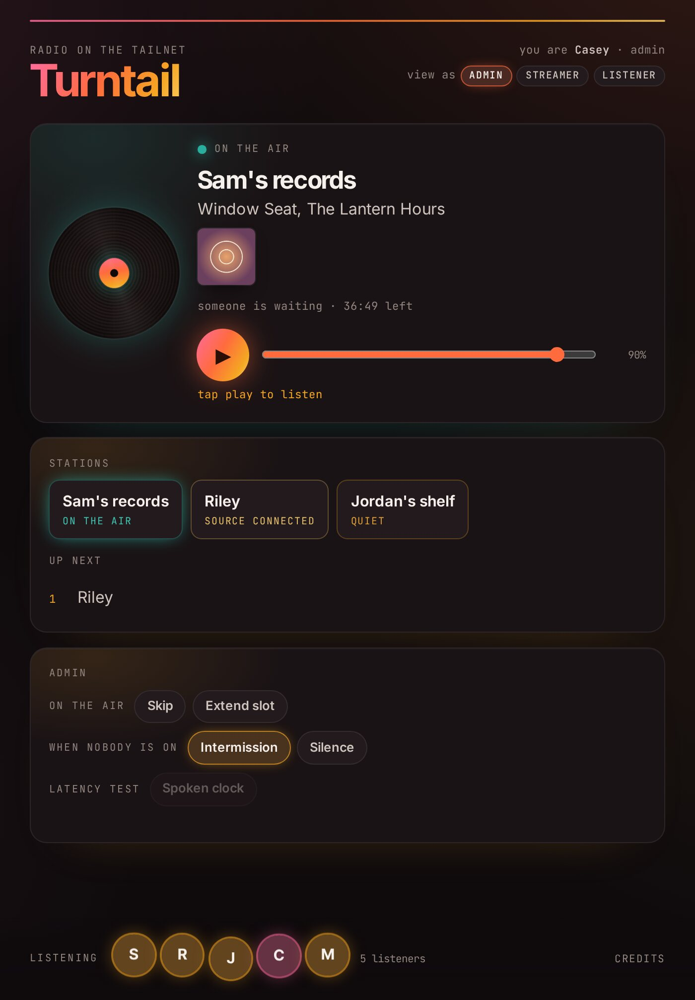

# Hosting a hub

The hub is the server everyone's stations send to and everyone's phones play from. One person in a group runs it. It needs a Tailscale network you control and a Debian 13 machine, and setup takes about half an hour.

Nobody joins your Tailscale network to use it. Listeners and broadcasters accept a share of the hub on their own Tailscale accounts, and the policy file decides what each of them can reach.

## What you need

| Thing | Notes |
|---|---|
| A Tailscale network you are an admin of | Your existing one, or a new one for the group. |
| A Debian 13 machine | A $6 cloud server with one CPU and 1 GB of memory is plenty for a group of friends. Another Raspberry Pi or a VM at home should work too. |
| An SSH key on your computer | For logging in to the server. |
| A Discogs personal token | Optional, for record covers in the lookup box. |

## 1. Set up the Tailscale network

In the [Tailscale admin console](https://login.tailscale.com/admin):

1. Go to **DNS**. Make sure **MagicDNS** is on, and under **HTTPS Certificates** click **Enable**. Note the **Tailnet DNS name** on that page, something like `example-tailnet.ts.net`. You need it in step 3.
2. Go to **Access controls**. Open [`policy/policy.example.hujson`](../policy/policy.example.hujson) from this repo and copy it into the editor. It has an example streamer called `alice@example.com`. Delete that grant for now, or change it to your own login if you want a station of your own. Save.

   If this is an existing network that already has a policy, do not replace it. Copy the `tag:hub` line into your `tagOwners`, add the grants to your `grants`, and add the `ssh` rule.

3. Go to **Settings**, then **Keys**, and generate an auth key. Leave **Reusable** and **Ephemeral** off. Turn on **Tags** and choose `tag:hub`. If your network has device approval turned on, also tick **Pre-approved**. Copy the key, which starts with `tskey-auth-`. It is only used once, by setup.

## 2. Make the server

Create a Debian 13 server with your SSH key. On a machine at home, use your own login and put `sudo` in front of the setup commands below.

If the server is with a cloud provider, or is otherwise on the public internet, check its firewall. Defaults vary between providers, and a server you meant to keep private can end up reachable by anyone. Open only SSH (port 22) for setup. Turntail itself needs no inbound ports.

## 3. Run setup

Log in as root, with the server's public IP address:

```
ssh root@<server ip>
```

Then get Turntail and run setup with your own two values: the hub's full name (`turntail.` plus your tailnet DNS name from step 1) and the auth key.

```
apt-get update
apt-get install -y git
git clone https://github.com/chriscantey/turntail.git /root/turntail
cd /root/turntail
HUB_FQDN=turntail.<your tailnet DNS name> TS_AUTHKEY=<auth key> bash hub/setup.sh
```

The first part of `HUB_FQDN` becomes the hub's machine name, so with `turntail.example-tailnet.ts.net` the hub shows up in your Machines list as `turntail`.

Setup installs Icecast and the page, joins your Tailscale network with the `tag:hub` tag, starts the two built-in sources (the spoken clock and the intermission loop), and points Tailscale at the page. It ends with `== done: https://turntail.<your tailnet DNS name>/`.

From here on you can reach the server over Tailscale SSH from any device on your network, `ssh root@turntail`. If you opened port 22 on a public server in step 2, close it now.

## 4. Check it

```
sudo turntail-hub status
```

The `services` line should show `active` four times, and `mounts` should list `demo`. The `house` mount appears once you add intermission music (see below). Then open `https://turntail.<your tailnet DNS name>/` on any of your own devices that are on the network. You are an admin of the network, so you see the admin controls, and the spoken clock button lets you hear the hub straight away.

<p align="center">
  
</p>

## 5. Make the share link

In the admin console, open **Machines**, click the menu on the hub's row, and choose **Share**. Create the share link and copy it. The same link works for everyone you invite.

## Adding a listener

Send them the share link, the page address (`https://turntail.<your tailnet DNS name>/`) and the [listening guide](listening.md). With the share alone they can reach the page and nothing else.

## Adding a broadcaster

A broadcaster starts as a listener. Once their page plays, they send you their Tailscale login, the one they accepted the share with (an email address, or something like `alice@github`). Then:

1. **Add a grant to the policy.** In **Access controls**, add this to `grants`, with their login and a short station name of your choosing (lowercase letters, numbers and hyphens):

    ```
    {
        "src": ["alice@example.com"],
        "dst": ["tag:hub"],
        "ip":  ["443", "8000"],
        "app": {"turntail.internal/cap/role": [{"role": "streamer", "mount": "alice"}]},
    },
    ```

    Save. Port 8000 is where their station sends audio, and the `app` part is what shows them their station on the page. To make them a page admin as well, add `{"role": "admin"}` to that list.

2. **Create their station on the hub**, with the same station name and the name the page shows for it:

    ```
    sudo turntail-hub stations add alice "Alice's records"
    ```

    It prints a reminder about the grant, then the line to send them, `HUB=... MOUNT=alice MOUNT_PW=...`. The password is shown this once.

3. **Send them that line privately**, in a direct message rather than a shared document or email, along with the [broadcasting guide](broadcasting.md).

When their Pi connects, `sudo turntail-hub status` shows their station as `(source connected)`.

To remove a broadcaster, run `sudo turntail-hub stations remove alice` and delete their grant from the policy.

## Running it

```
sudo turntail-hub status                        services, who is live, queue, listeners, stations
sudo turntail-hub stations add <name> "<Display name>"
sudo turntail-hub stations list
sudo turntail-hub stations remove <name>
sudo turntail-hub music normalize               after adding intermission music
sudo turntail-hub music on                      play the intermission loop when nobody is on (off to stop)
sudo turntail-hub demo on                       run the spoken clock source (off to stop)
sudo turntail-hub logs hub                      follow a log: hub, demo, music or icecast
sudo turntail-hub backup > turntail-etc.tgz     the station list and passwords, keep it private
sudo turntail-hub deploy /root/turntail         after updating, see below
```

The page has admin controls too: skip the live station, extend its slot, and switch between the intermission loop and silence when nobody is on.

### Intermission music

The hub ships with no music. Copy MP3s to the server and level them:

```
scp *.mp3 root@turntail:/tmp/
ssh root@turntail
sudo mv /tmp/*.mp3 /var/lib/turntail/music/
sudo turntail-hub music normalize
```

Normalize brings every file to the same loudness and restarts the loop. The credits link on the page lists what is in the folder, and files downloaded from Pixabay with their original names get a link back to the track.

### Record covers

For covers in the lookup box, make a personal access token in your Discogs account settings, add a line `DISCOGS_TOKEN=<token>` to `/etc/turntail/hub.env` on the server, and run `sudo systemctl restart turntail-hub`. Without it the lookup falls back to MusicBrainz, with no covers.

### Turn-taking

The numbers live in `/etc/turntail/hub.env`: `SLOT_MINUTES` (default 60), `MIN_REMAIN_MINUTES` (10), `WARN_MINUTES` (5) and `GRACE_MINUTES` (2). Add or change a line, then `sudo systemctl restart turntail-hub`.

### Updating

```
sudo git -C /root/turntail pull
sudo turntail-hub deploy /root/turntail
```

Deploy installs the new page and commands and restarts the page. If the update changed the built-in sources, restart them with `sudo systemctl restart turntail-demo turntail-house`.

Tailscale keeps itself updated. Keeping Debian updated is up to you.
