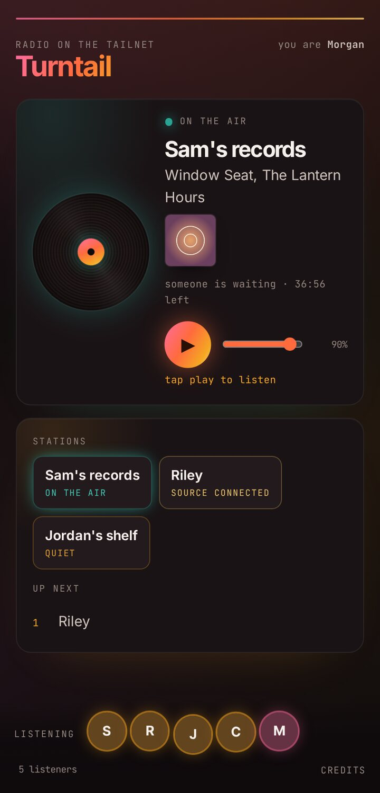

# Listening

You need Tailscale on a phone or computer and two things from whoever runs the hub. It takes about five minutes the first time. After that you only open the page.

Whoever runs the hub sends you:

- a **Tailscale share link**
- the **page address**, which looks like `https://turntail.example-tailnet.ts.net/`

## 1. Accept the share

Open the share link and sign in to Tailscale. If you already use Tailscale, sign in with your usual account. If you don't, signing in with Google, Apple, Microsoft or GitHub creates a free personal account. Then accept the shared machine.

Accepting the share lets you reach the hub's page and nothing else on the hub owner's network, and the hub cannot reach any of your devices.

## 2. Put Tailscale on your phone or computer

Install Tailscale (App Store or Google Play on a phone, [tailscale.com/download](https://tailscale.com/download) on a computer), sign in with the same account you used in step 1, and turn it on.

## 3. Open the page and press play

Open the page address in any browser. You will see a record and a play button. Press play. If the play button is gray, nothing is playing right now.

  

Your name and picture come from your Tailscale account, and they show up at the bottom of the page with everyone else who is listening. To get back to it quickly, bookmark it, or on a phone add it to your home screen from the browser's share menu.

## If it doesn't play

- **The page doesn't load.** Check that Tailscale is turned on in the app. The hub should appear in the app's list of machines. If it is there and the page still won't load, open the [Tailscale admin console](https://login.tailscale.com/admin/dns), go to DNS, and make sure MagicDNS is turned on.
- **The page says "tap play to listen".** The browser stopped the audio from starting by itself. Press play.
- **The page says "nothing on right now".** Nobody is on the air and the hub isn't playing anything between records. Leave the page open and it starts playing when someone goes live.
- **The sound drops for a moment.** The page reconnects by itself and says so under the play button.

## Playing your own records

If you want to put your own turntable on the air later, the [broadcasting guide](broadcasting.md) picks up from here. Everything you just set up carries over.
